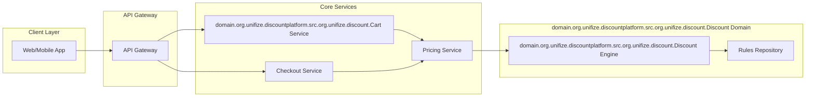
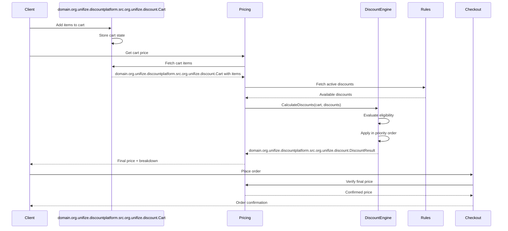
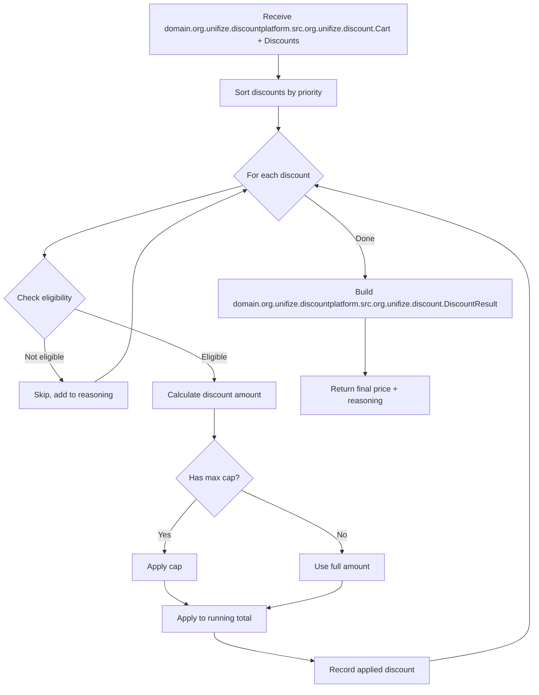
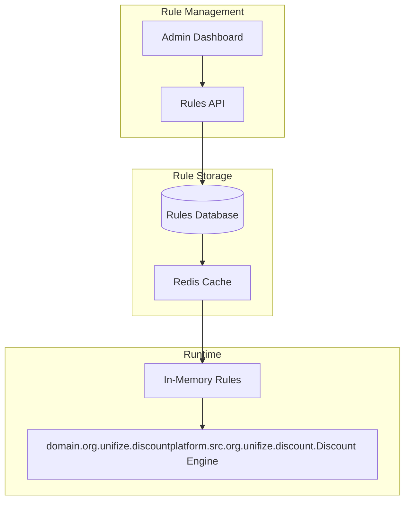

# Architecture Documentation

## Service Boundaries

### High-Level Architecture



### Service Responsibilities

| Service | Responsibility | Owns |
|---------|---------------|------|
| **domain.org.unifize.discountplatform.src.org.unifize.discount.Cart Service** | Manage cart items, quantities | domain.org.unifize.discountplatform.src.org.unifize.discount.Cart state, item metadata |
| **Pricing Service** | Calculate prices, apply discounts | Price calculations, discount orchestration |
| **domain.org.unifize.discountplatform.src.org.unifize.discount.Discount Engine** | Evaluate rules, calculate discount amounts | domain.org.unifize.discountplatform.src.org.unifize.discount.Discount logic, eligibility checks |
| **Rules Repository** | Store and retrieve discount rules | Rule definitions, validity periods |
| **Checkout Service** | Process orders, handle payments | Order creation, payment processing |

---

## Data Flow Diagram



---

## domain.org.unifize.discountplatform.src.org.unifize.discount.Discount Engine Flow



---

## Key APIs

### 1. Calculate Discounts

**Purpose:** Calculate final price after applying all eligible discounts

```
POST /api/v1/pricing/calculate
```

**Request:**
```json
{
  "cartId": "cart-123",
  "voucherCode": "SUPER69",
  "paymentMethod": {
    "bank": "ICICI",
    "cardType": "CREDIT"
  }
}
```

**Response:**
```json
{
  "originalTotal": 699700,
  "finalPrice": 537792,
  "currency": "INR",
  "appliedDiscounts": [
    {
      "discountId": "BRAND_PUMA_40",
      "type": "BRAND",
      "amount": 79920,
      "description": "40% off PUMA items"
    },
    {
      "discountId": "CAT_TSHIRT_10",
      "type": "CATEGORY",
      "amount": 11988,
      "description": "10% off T-shirts"
    }
  ],
  "skippedDiscounts": [
    {
      "discountId": "HDFC_15",
      "reason": "Payment method not HDFC"
    }
  ],
  "totalSavings": 161908
}
```

### 2. Validate Voucher

**Purpose:** Check if a voucher code is valid and applicable

```
POST /api/v1/discounts/voucher/validate
```

**Request:**
```json
{
  "voucherCode": "SUPER69",
  "cartId": "cart-123",
  "customerId": "cust-456"
}
```

**Response:**
```json
{
  "valid": true,
  "discountId": "SUPER69",
  "discountPercent": 69,
  "maxCap": 50000,
  "excludedBrands": ["Nike"],
  "estimatedSavings": 50000,
  "message": "Voucher applicable! Max savings ₹500"
}
```

### 3. Get Active Discounts

**Purpose:** Retrieve all currently active discount rules

```
GET /api/v1/discounts/active
```

**Response:**
```json
{
  "discounts": [
    {
      "id": "BRAND_PUMA_40",
      "type": "BRAND",
      "description": "40% off PUMA",
      "validUntil": "2024-12-31"
    }
  ],
  "count": 4
}
```

---

## Where domain.org.unifize.discountplatform.src.org.unifize.discount.Discount Rules Live

### Storage Architecture



### Rule Evaluation Pipeline

1. **Load Phase:** Rules loaded from cache/DB at startup and on schedule
2. **Filter Phase:** Filter rules by `active=true` and valid date range
3. **Match Phase:** For each cart item, find applicable rules by type
4. **Calculate Phase:** Apply percentage, enforce caps
5. **Aggregate Phase:** Sum all discounts, build result

---

## Design Decisions

### Why Separate domain.org.unifize.discountplatform.src.org.unifize.discount.Discount Engine?

1. **Single Responsibility:** Pricing service orchestrates, engine calculates
2. **Testability:** Engine can be unit tested with in-memory rules
3. **Flexibility:** Engine can be replaced/upgraded independently
4. **Reusability:** Same engine for checkout preview, final calculation, refunds

### Why Priority-Based Sequential Application?

1. **Deterministic:** Same cart + discounts = same result always
2. **Debuggable:** Easy to trace which discount affected which item
3. **Business Aligned:** Mirrors how discounts are conceptually "stacked"

### domain.org.unifize.discountplatform.src.org.unifize.discount.Money Representation

All monetary values stored as **paise (cents)** - `long` integers:
- `₹999.00` stored as `99900`
- Avoids floating-point precision errors
- Division/rounding handled explicitly at display layer
